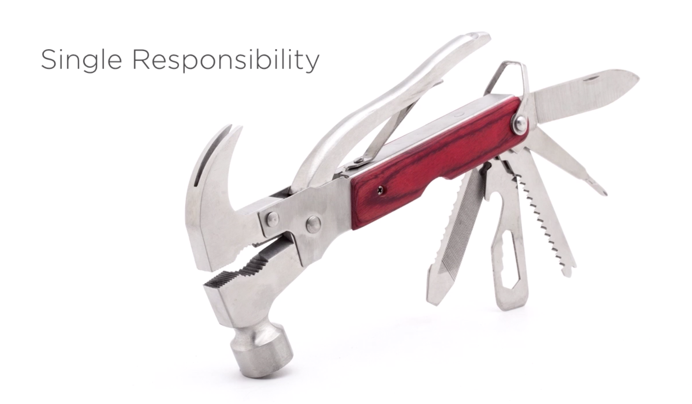
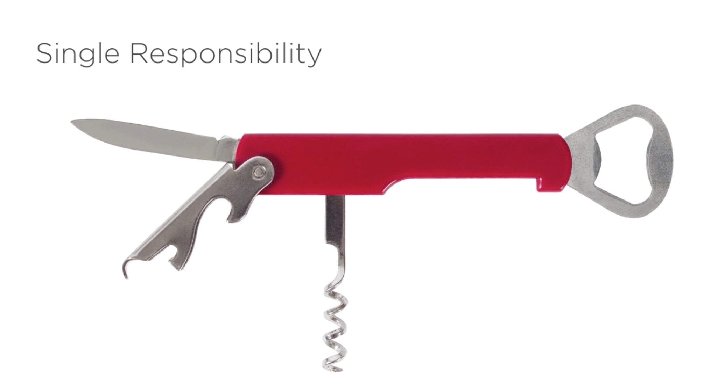

# designpatterns

## Creational Patterns
* [Factory](https://sourcemaking.com/design_patterns/factory_method)
* [Factory Linda](https://www.lynda.com/Developer-Programming-Foundations-tutorials/Encapsulating-object-creation/135365/158253-4.html?srchtrk=index%3a2%0alinktypeid%3a2%0aq%3a+Course%3a+Programming+Foundations%3a+Design+Patterns%0apage%3a1%0as%3arelevance%0asa%3atrue%0aproducttypeid%3a2)

## Behavioural
* Strategy, Singleton
* Composite, Iterator,  Mediator, Observer, Decorator
* Flyweight,

## Solid
* [Solid](https://en.wikipedia.org/wiki/SOLID)
* [Lynda.com](https://www.lynda.com/Developer-Programming-Foundations-tutorials/Foundations-Programming-Design-Patterns/135365-2.html?srchtrk=index%3a2%0alinktypeid%3a2%0aq%3a+Course%3a+Programming+Foundations%3a+Design+Patterns%0apage%3a1%0as%3arelevance%0asa%3atrue%0aproducttypeid%3a2)

## Open/closed priciple
* [Open/closed](https://en.wikipedia.org/wiki/Open%E2%80%93closed_principle)
